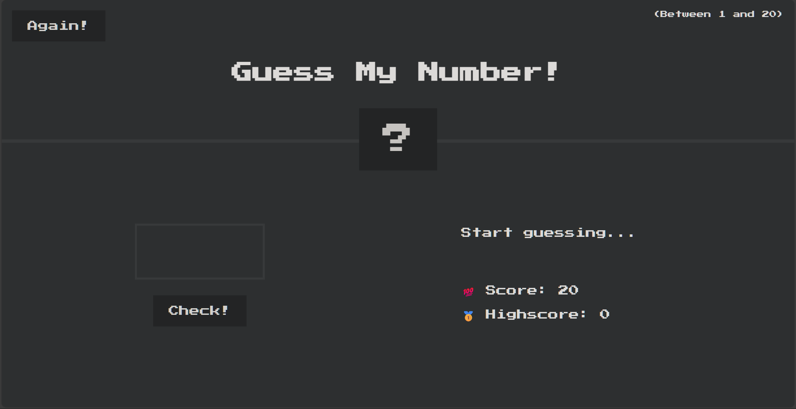
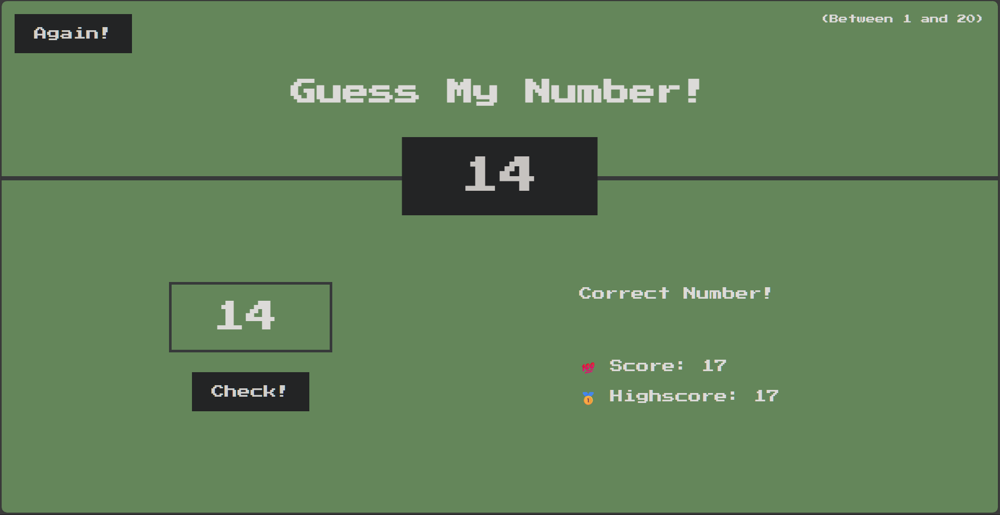
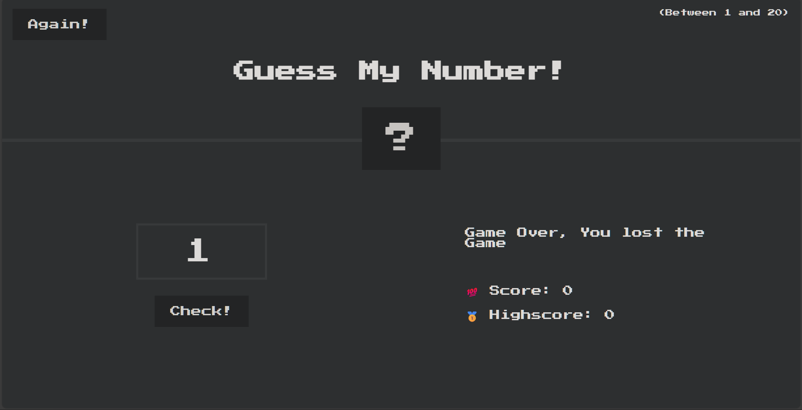

# 🎯 Guess My Number!

> ℹ️ This Game was built with Reference to [JavaScript Course on Udemy](https://www.udemy.com/course/the-complete-javascript-course/?couponCode=KEEPLEARNING) for learning purposes.

A simple browser game where you guess a secret number between 1–20. Your score decreases with each wrong guess — beat your highscore!

---

## 🚀 Live Demo

[👉 Play on GitHub Pages](https://nadeemkhan404.github.io/Guess-The-Number/)

---

## 📝 How to Play

- Enter a number between **1–20** and press **Check!**
- Get hints like **Too High!** or **Too Low!** until you guess correctly
- Score starts at **20** and drops with each wrong guess
- When you guess correctly, the background turns green and your highscore updates
- Press **Again!** to reset and play again

---

## 🧰 Technologies Used

- **HTML5**
- **CSS3**
- **Vanilla JavaScript (ES6+)**

---

## ✨ Skills & Concepts Invloved

- **DOM selection & manipulation** using `document.querySelector`, `.textContent`, and `.value`
- **Event handling** with `addEventListener` for button clicks
- **Random number generation** (`Math.random()`, `Math.trunc()`) for secret number
- **Inline style manipulation** to change background color & width of number box on win
- **State management** with `score`, `highscore` and `number` variables
- **Game reset functionality** to restore initial state when **Again!** is clicked
- **Refactoring / DRY principle** by creating a helper `displayMessage()` function

---

## 🧩 Project Structure

```text
guess-my-number/
├── index.html
├── style.css
├── script.js
└── screenshots/
    ├── start.png
    ├── correct.png
    └── game-over.png
```

---

## 📸 Screenshots

| Game Start                      | Correct Guess                       | Game Over                               |
| ------------------------------- | ----------------------------------- | --------------------------------------- |
|  |  |  |

---

## 🗂️ Key Files

- `index.html` — game layout & UI
- `style.css` — styling and layout
- `script.js` — game logic & event handling

---
